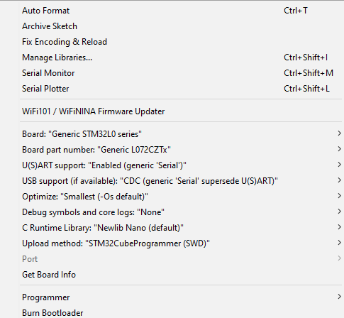

# EC-M12-BC-C6-C-A  
Battery-Powered Cellular IoT Data Logger (IP67 - NB-IoT)

## Overview  
The **EC-M12-BC-C6-C-A** is a rugged, battery-powered IoT data logger with NB-IoT connectivity, designed for industrial and remote monitoring applications.  
This repository contains firmware and resources for programming the STM32 microcontroller using the Arduino IDE.

---

## 🧩 Arduino IDE Configuration  

To program the **STM32L0 series** microcontroller in this device using the **Arduino IDE**, follow the configuration below:

### Board Configuration  
- **Board:** Generic STM32L0 Series  
- **Board Part Number:** Generic L082CZTx  
- **U(S)ART Support:** Enabled (Generic Serial)  

### Required Setup Steps  
1. Install the **STM32 Arduino Core** from the Arduino Boards Manager.  
   - Go to: `File → Preferences`  
   - Add the following URL to *Additional Boards Manager URLs*:  
     ```
     https://github.com/stm32duino/BoardManagerFiles/raw/main/package_stmicroelectronics_index.json
     ```
   - Then, go to: `Tools → Board → Boards Manager`, search for **STM32**, and install it.  
2. Select the correct board and part number as listed above.  
3. Connect your board via ST-Link or USB interface.  
4. Select the correct **Port** and **Upload method** under the *Tools* menu.  

---

## 📚 Required Libraries  

The following libraries are required for proper operation. Please ensure they are installed with the correct versions:

| Library Name | Version | GitHub Link |
|---------------|----------|-------------|
| STM32duino Low Power | 1.3.0 | [STM32LowPower](https://github.com/stm32duino/STM32LowPower) |
| STM32RTC | Main Branch | [STM32RTC](https://github.com/stm32duino/STM32RTC?files=1) |

To install these libraries:  
- Open Arduino IDE → **Sketch → Include Library → Manage Libraries...**  
- Search for the library name and install the mentioned version.  
- Alternatively, you can clone the repositories directly into your `libraries` folder.

---

## 🖼️ Upload and Board Details  

Below are example configurations and board details for uploading code to the STM32:

### Upload Configuration  


### STM32 Board Details  


*(Ensure both images are placed inside an `/images` folder in your repository.)*

---

## 🔗 Useful Links  

- [**User Guide**](https://norvi.io/docs/ec-m12-bc-c6-c-a-user-guide/)  
- [**Product Page**](https://norvi.io/battery-powered-data-logger-ip67-nb-iot/)  
- [**Product Purchase**](https://shop.norvi.lk/products/battery-powered-cellular-iot-data-logger-ip67-nb-iot-ec-m12-bc-c6-c-a)

---

## ⚙️ Technical Highlights  
- STM32L082CZTx ARM Cortex-M0+ microcontroller  
- NB-IoT connectivity  
- Battery-powered operation (IP67 enclosure)  
- Ultra-low power consumption  
- Multiple sensor and digital I/O interfaces  

---

## 🧾 License  
This project is released under the **MIT License**.  
Please see the [LICENSE](LICENSE) file for more information.

---

## 📧 Support  
For technical support or additional documentation, visit [norvi.io](https://norvi.io) or contact the Norvi support team.
